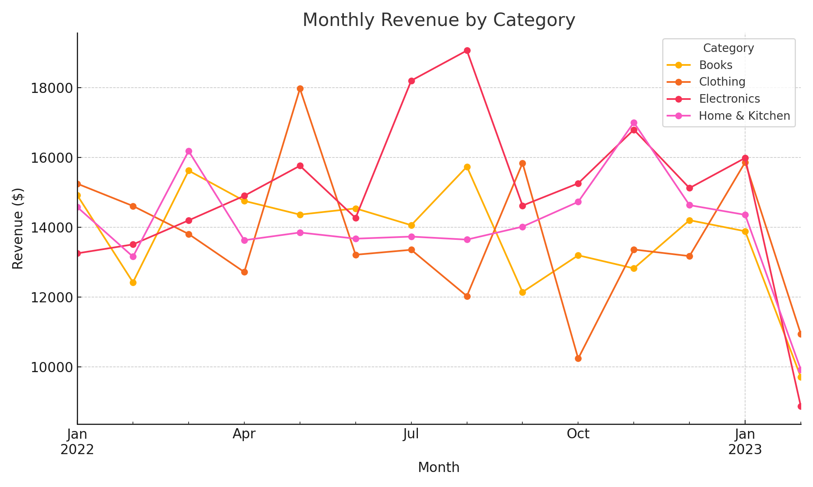
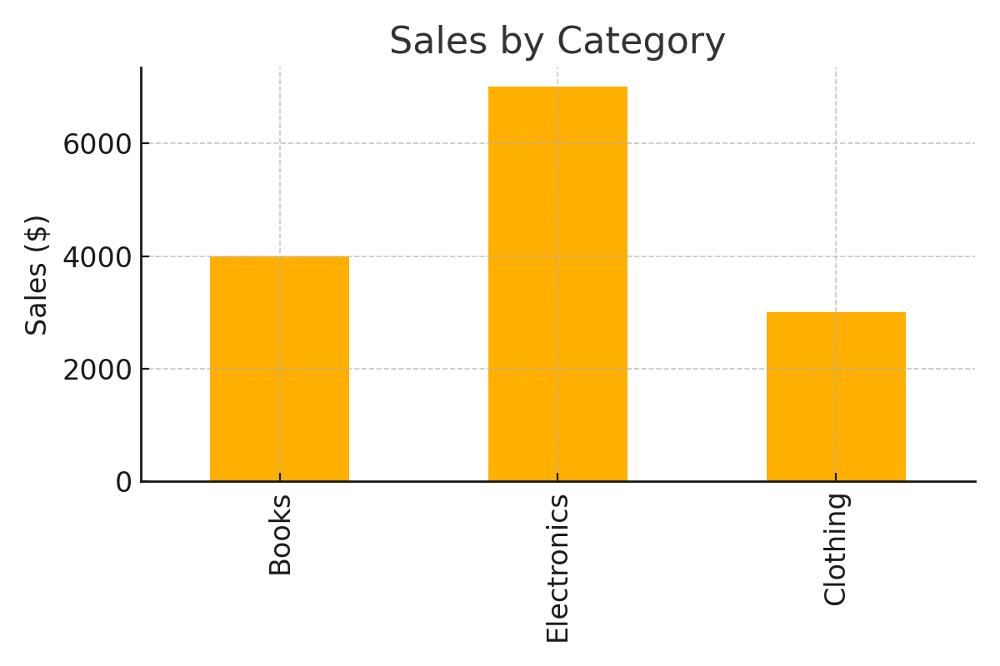
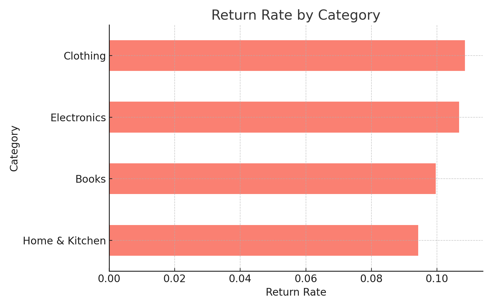

# E-Commerce Sales Data Analytics

This **Google Colab** project simulates and analyzes over 10,000 e-commerce orders. It performs ETL and exploratory data analysis using **Python** libraries (Pandas, NumPy, Seaborn, Matplotlib). The analysis visualizes key business metrics such as **monthly revenue trends**, **return rates**, and **sales distribution by product category**.

## Project Objectives

- Simulate realistic e-commerce data
- Clean and process the dataset
- Analyze order volume, return patterns, and sales by category
- Visualize insights using Python

## Setup (Google Colab)

Open the `ecommerce_analytics.ipynb` notebook in [Google Colab](https://colab.research.google.com/) and run all cells. Dependencies are already available in the Colab environment.

## Sample Visualizations

  
  

## Future Improvements

- Add interactive dashboard with Plotly or Dash
- Integrate real-world datasets
- Include time-series forecasting for sales

## License

This project is licensed under the MIT License.
